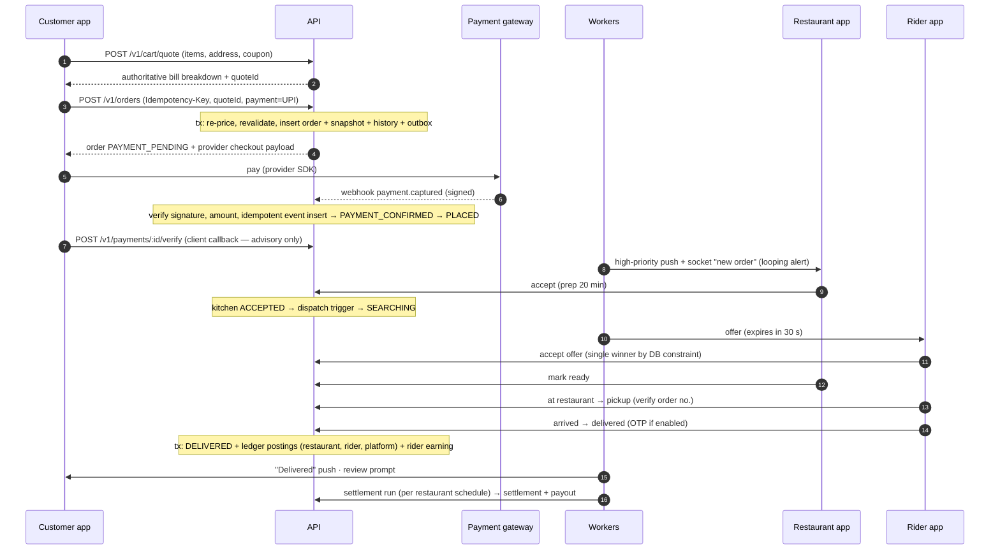

# Order flow (end to end)

Status: **Phase 5 implements checkout (cash on delivery), restaurant acceptance, the acceptance timeout,
cancellations, notifications and realtime; online payment is Phase 7 and riders Phase 6.** The diagram is the
target flow. State definitions live in [ORDERS.md](ORDERS.md); money in
[PRICING.md](PRICING.md), [PAYMENTS.md](PAYMENTS.md), [SETTLEMENTS.md](SETTLEMENTS.md).

## Happy path — online payment

## COD differences

- Order goes CREATED → PLACED immediately (no payment phase) after COD eligibility checks.
- Dispatch only offers to riders with COD enabled and enough headroom under their COD limit.
- On DELIVERED the rider confirms the collected amount; this books `COD_COLLECTED` to the rider ledger.
  The platform treats the cash as **in transit** until a `rider_cod_deposits` row is verified ([PAYMENTS.md §4](PAYMENTS.md#4-cod-flow)).

## Key alternate flows (all automated as E2E tests — [TESTING.md](TESTING.md))

| Scenario | Outcome |
|---|---|
| Restaurant rejects | RESTAURANT_REJECTED; full refund (online) or nothing to collect (COD); customer notified |
| Restaurant doesn't respond | timeout job → fallback (escalate → auto-reject by default) |
| Rider rejects / times out | offer marked, next rider offered; after N attempts → NO_RIDER_FOUND → ops alert |
| Customer cancels before accept | CUSTOMER_CANCELLED, free, full refund |
| Customer cancels after accept | per cancellation rule: fee, partial refund, restaurant compensation |
| Payment fails / expires | PAYMENT_FAILED; coupon usage and stock released |
| Payment succeeds but webhook delayed | order stays PAYMENT_PENDING; client verify call triggers server-side provider status fetch; reconciliation job polls pending payments |
| Duplicate webhook | second `payment_events` insert is a unique-violation no-op |
| Late success after failure/cancel | automatic full refund, audit-logged |
| Item becomes unavailable / restaurant closes / price changes during checkout | `POST /v1/orders` re-prices and revalidates → 409 with a fresh quote; nothing is created |
| Restaurant app offline | NOTIFIED never reached → escalation path; ops dashboard alert |
| Rider loses internet | location updates queue on device and flush on reconnect; state changes are idempotent retries |
| Double tap on "Place order" | same Idempotency-Key → same order returned |
